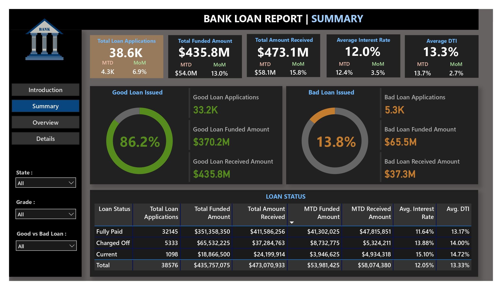
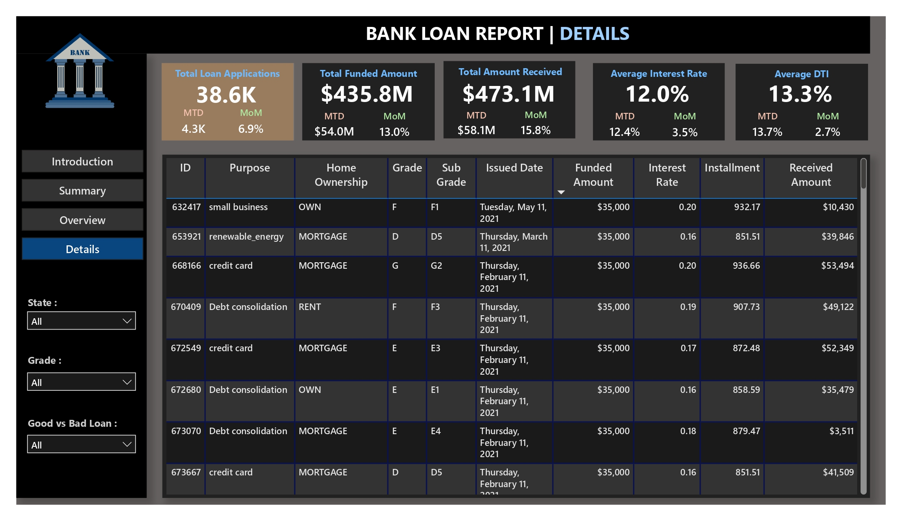

# 🏦 Bank Loan Insights - Data Analysis Dashboard

**"An insightful dashboard analyzing bank loan patterns and customer behavior."**

**Bank Loan Insights** is an interactive analytics project built using **Power BI** and real-world loan data. The dashboard and accompanying reports offer clear visualizations of key insights in loan trends, customer segments, and financial risk. It is designed for banks, analysts, and decision-makers to quickly grasp complex loan data.

---

## 🌐 View Live Project

👉 [View Report](https://bank-loan-insights.netlify.app)
👉 [View Dashboard](https://lookerstudio.google.com/reporting/0aa7dea1-76d6-4421-9d89-3ed22c6ec909)
---

## 🖼️ Cover Page


---

## ✨ Features

- **📊 Visual Storytelling:** Understand trends in loan approvals, defaults, and customer behaviors.
- **📌 Detailed Dashboards:** Summary, overview, and deep-dive views powered by Power BI.
- **🌍 Geographic Insights:** Heatmaps show regional trends and risks.
- **📈 Monthly & Term Trends:** Analyze performance over time and loan durations.
- **📤 Exportable Reports:** Includes PDF and HTML formats for presentations and sharing.
- **💡 Actionable Insights:** Designed to help stakeholders make informed financial decisions.

---

## 📁 Project Structure

```

│   README.md
│
├───assets
│       Bad Loan.png
│       bank_logo.jpg
│       cover_image.png
│       details.jpg
│       Employee Length.png
│       Geographic Heatmap.png
│       Good Loan.png
│       Loan Purpose.png
│       Long Term.png
│       Monthly Trend.png
│       overview.jpg
│       summary.jpg
│
├───data
│       financial_loan.csv
│
├───powerBI
│       bank_loan_data_insights.pbix
│
└───reports
        bank_loan_comprehensive_report.pdf
        index.html
        summary.pdf
```

---

## 🧪 Setup & Usage

1. **Open Power BI File:**

   Open `powerBI/bank_loan_data_insights.pbix` with [Power BI Desktop](https://powerbi.microsoft.com/desktop).

2. **Explore Dataset:**

   Raw dataset used: `data/financial_loan.csv`.

3. **View Reports:**

   - 📄 PDF: `reports/bank_loan_comprehensive_report.pdf`
   - 🌐 HTML Summary: `reports/index.html`

---

## 📷 Screenshots

### 🔹 Summary Dashboard


### 🔹 Overview Dashboard


### 🔹 Detailed Dashboard


---

## 👨‍💻 Developer

**Faisal Khan**

- 🌐 [Portfolio](https://khanfaisal.netlify.app)
- 💼 [LinkedIn](https://www.linkedin.com/in/khanfaisal04)
- ✍️ [Medium](https://medium.com/@khanfaisal79960)
- 📸 [Instagram](https://instagram.com/glitchghost21)
- 💻 [GitHub](https://github.com/khanfaisal79960)

---

> Crafted with 📊 by Faisal Khan.
