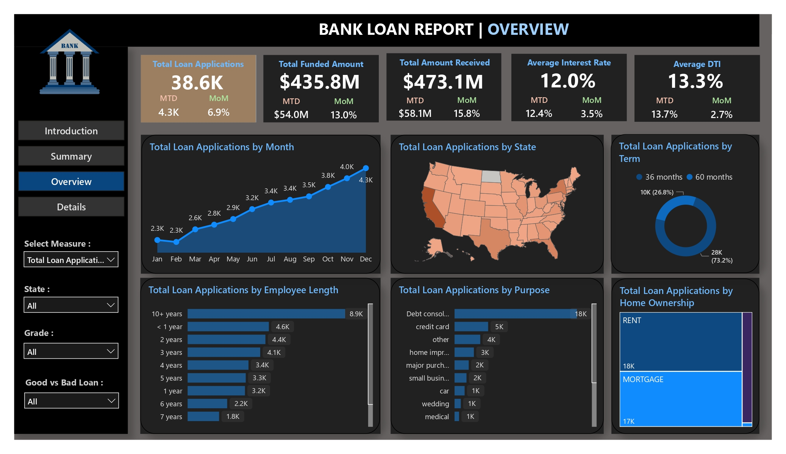

<h1 align="center" id="title">Bank Loan Insights</h1>

<p align="center"></p>

<p id="description">This project aims to explore and analyze historical loan application data to identify key trends customer segments and factors influencing loan approval decisions. By using data analysis and visualization techniques the project provides actionable insights that can help financial institutions optimize their loan policies and improve approval accuracy.</p>

<h2>🚀 Demo</h2>

[https://lookerstudio.google.com/s/p8WTvQ5COeM](https://lookerstudio.google.com/s/p8WTvQ5COeM)

<h2>Project Screenshots:</h2>




  
  
<h2>🧐 Features</h2>

Here're some of the project's best features:

*   📌 Data Cleaning & Preprocessing
*   📊 Exploratory Data Analysis (EDA)
*   📉 Risk Factor Analysis
*   📁 Segmentation of Applicants
*   📈 Interactive Visualizations
*   🔍 Insights Summary
*   📊 Dashboard (Optional/Planned)

<h2>🛠️ Installation Steps:</h2>

<p>1. Clone the Repository Begin by cloning the repository to your local machine: bash Copy Edit</p>

```
git clone https://github.com/khanfaisal79960/Bank-Loan-Insights.git cd Bank-Loan-Insights
```

<p>2. Download Power BI (if not installed)</p>

<p>3. Open bank_loan_data_insights.pbix in power bi</p>

  
  
<h2>💻 Built with</h2>

Technologies used in the project:

*   Power BI
*   Google Data Studio / Looker Studio
*   Advanced Excel
*   DAX
